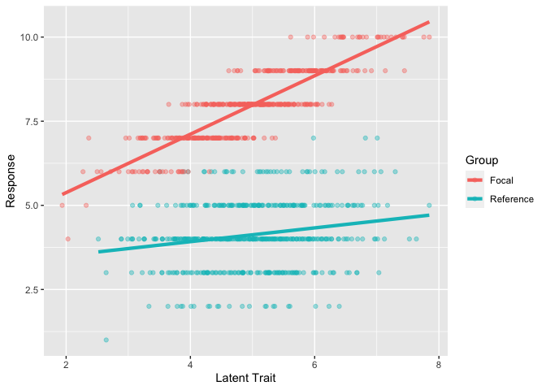

dMACS_Shrunk Example
================
Conor Lacey
2023-02-26

``` r
rm(list = ls())
suppressWarnings(library(tidyverse))
```

    ## ── Attaching packages ─────────────────────────────────────── tidyverse 1.3.2 ──
    ## ✔ ggplot2 3.4.0     ✔ purrr   0.3.4
    ## ✔ tibble  3.1.8     ✔ dplyr   1.0.8
    ## ✔ tidyr   1.1.4     ✔ stringr 1.4.0
    ## ✔ readr   2.1.3     ✔ forcats 0.5.1
    ## ── Conflicts ────────────────────────────────────────── tidyverse_conflicts() ──
    ## ✖ dplyr::filter() masks stats::filter()
    ## ✖ dplyr::lag()    masks stats::lag()

``` r
suppressWarnings(library(faux))
```

    ## 
    ## ************
    ## Welcome to faux. For support and examples visit:
    ## https://debruine.github.io/faux/
    ## - Get and set global package options with: faux_options()
    ## ************

### Introduction

So this is meant to demonstrate how dMACS_Shrunk should theoretically
work with some fake data I created. In this demonstration I will
demonstate this method with just one item for simplicity sake.

### Fake Data

``` r
set.seed(1489)

fakedatR <- rnorm_multi(n = 500, 
                          mu = c(5, 4), 
                          sd = c(1, 1), 
                          r = c(0.1), 
                          varnames = c("Eta", "Response"))

fakedatR$Response <- fakedatR$Response %>% round()
fakedatR$Response <- if_else(fakedatR$Response > 10, 10, fakedatR$Response)

fakedatR <- fakedatR %>% mutate (group = "R")

fakedatF <- rnorm_multi(n = 500, 
                          mu = c(5,8), 
                          sd = c(1, 1), 
                          r = c(0.9), 
                          varnames = c("Eta", "Response"))

fakedatF$Response <- fakedatF$Response %>% round()
fakedatF$Response <- if_else(fakedatF$Response > 10, 10, fakedatF$Response)

fakedatF <- fakedatF %>% mutate (group = "F")

fakedat <- bind_rows(fakedatR, fakedatF)

fakedat %>% ggplot(aes(x = Eta, y = Response, color = group)) + 
  geom_point(alpha = 0.4) + 
  stat_smooth(method = lm, se = FALSE, linewidth = 1.5) + 
  labs(x = "Latent Trait",
       color = "Group") + 
  scale_color_discrete(labels = c("Focal", "Reference"))
```

    ## `geom_smooth()` using formula = 'y ~ x'

<!-- -->

Awesome. Fake data created. To clarify I have to add the participants
estimated latent score for the reference group given that the formula
requires this in the calculation. The estimated latent score must of
course also correlate with the item hence why I use the rnorm_multi()
function from the “faux” package. However, the bigger picture that
should be seen here is that there is clearly and interaction effect
which what group you belong to. The group assignment is clearly
affecting the item’s loading and intercept.

### Calculating dMACS
