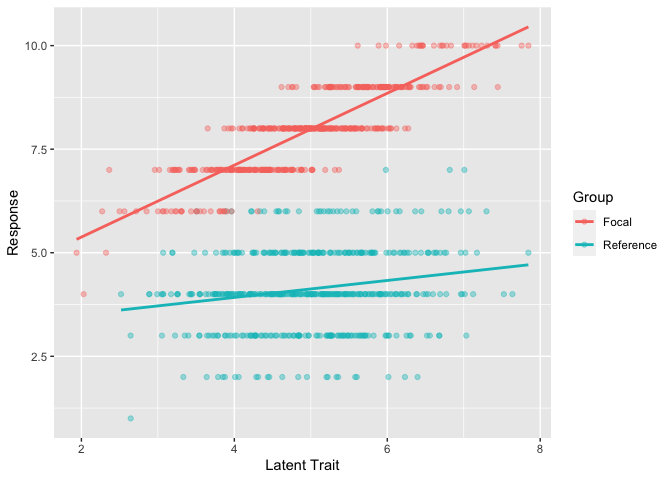

dMACS_Shrunk Example
================
Conor Lacey
2023-02-26

``` r
rm(list = ls())
suppressWarnings(library(tidyverse))
```

    ## ── Attaching packages ─────────────────────────────────────── tidyverse 1.3.2 ──
    ## ✔ ggplot2 3.4.0     ✔ purrr   0.3.4
    ## ✔ tibble  3.1.8     ✔ dplyr   1.0.8
    ## ✔ tidyr   1.1.4     ✔ stringr 1.4.0
    ## ✔ readr   2.1.3     ✔ forcats 0.5.1
    ## ── Conflicts ────────────────────────────────────────── tidyverse_conflicts() ──
    ## ✖ dplyr::filter() masks stats::filter()
    ## ✖ dplyr::lag()    masks stats::lag()

``` r
suppressWarnings(library(faux))
```

    ## 
    ## ************
    ## Welcome to faux. For support and examples visit:
    ## https://debruine.github.io/faux/
    ## - Get and set global package options with: faux_options()
    ## ************

### Introduction

So this is meant to demonstrate how dMACS_Shrunk should theoretically
work with some fake data I created. In this demonstration I use just one
item for simplicity sake.

### Fake Data

``` r
set.seed(1489)

fakedatR <- rnorm_multi(n = 500, 
                          mu = c(5, 4), 
                          sd = c(1, 1), 
                          r = c(0.1), 
                          varnames = c("Eta", "Response"))

fakedatR$Response <- fakedatR$Response %>% round()
fakedatR$Response <- if_else(fakedatR$Response > 10, 10, fakedatR$Response)

fakedatR <- fakedatR %>% mutate (group = "R")

fakedatF <- rnorm_multi(n = 500, 
                          mu = c(5,8), 
                          sd = c(1, 1), 
                          r = c(0.9), 
                          varnames = c("Eta", "Response"))

fakedatF$Response <- fakedatF$Response %>% round()
fakedatF$Response <- if_else(fakedatF$Response > 10, 10, fakedatF$Response)

fakedatF <- fakedatF %>% mutate (group = "F")

fakedat <- bind_rows(fakedatR, fakedatF)

fakedat %>% ggplot(aes(x = Eta, y = Response, color = group)) + 
  geom_point(alpha = 0.4) + 
  stat_smooth(method = lm, se = FALSE, linewidth = 1.5) + 
  labs(x = "Latent Trait",
       color = "Group") + 
  scale_color_discrete(labels = c("Focal", "Reference"))
```

    ## `geom_smooth()` using formula = 'y ~ x'

<!-- -->

Awesome. Fake data created. To clarify I have to add the participants
estimated latent score for the reference group given that the formula
requires this in the calculation. The estimated latent score must of
course also correlate with the item hence why I use the rnorm_multi()
function from the “faux” package. However, the bigger picture that
should be seen here is that there is clearly an interaction effect based
on what group you belong to. The group assignment is clearly affecting
the item’s loading and intercept.

### Calculating dMACS

``` r
eta<-seq(0,8, by = 0.5)
linearR <- lm(fakedatR$Response ~ fakedatR$Eta)
linearF <- lm(fakedatF$Response ~ fakedatF$Eta)

aR <- linearR$coefficients[1]
bR <- linearR$coefficients[2]

aF <- linearF$coefficients[1]
bF <- linearF$coefficients[2]

a <- (nrow(fakedatR)-1)*sd(fakedatR$Response)+(nrow(fakedatF)-1)*sd(fakedatF$Response)
b <- (nrow(fakedatR)-1) + (nrow(fakedatF)-1) 

den <- a/b

integrand <- function(x){
  ((aF + bF*x)-(aR + bR*x))*dnorm(x,5,1)
}

dMACS<-sqrt(integrate(integrand, -Inf, Inf)$value)/den

dMACS
```

    ## [1] 1.937263

Phew! That’s pretty dang big. I suspect it’s not typical to find a value
this large, however for the purposes of this example we can definitley
say that this item in non-invariant. However, now let’s see how much is
shrunk using the spike-and-slab method

### Spike-and-Slab

First let’s borrow some functions from the Bergh paper.

``` r
bf <- function(d, n, v0) {
  a <- 1 / sqrt(n * (v0 + 1))
  b <- n^2 * d^2
  c <- 2 * (n + 1 / v0)
  return(a * exp(b / c))
}

updatePar <- function(rho0, v0, N, ybar) {
  prec <- (N + 1 / v0)
  v1 <- 1 / prec
  c <- N * ybar
  mu1 <- v1 * c
  w <- bf(ybar, N, v0)
  rho1 <- rho0 / (rho0 + (1 - rho0) * w)
  return(c("ph0" = rho1, "mu" = mu1, "sd" = sqrt(v1)))
}
```

Let’s update our parameters. For this type of study, we will go with the
same assumptions as Bergh that the prior gaussian is N(0,1) such that
there is a mean dMACS of 0 and an standard deviation of 1.

``` r
priorPH0 <- 0.5
sigmaSlab <- 1
N <- nrow(fakedat)/2

sd = 4

diff = 8

den = 1/2

sqrt((diff^2*den))/sd
```

    ## [1] 1.414214
